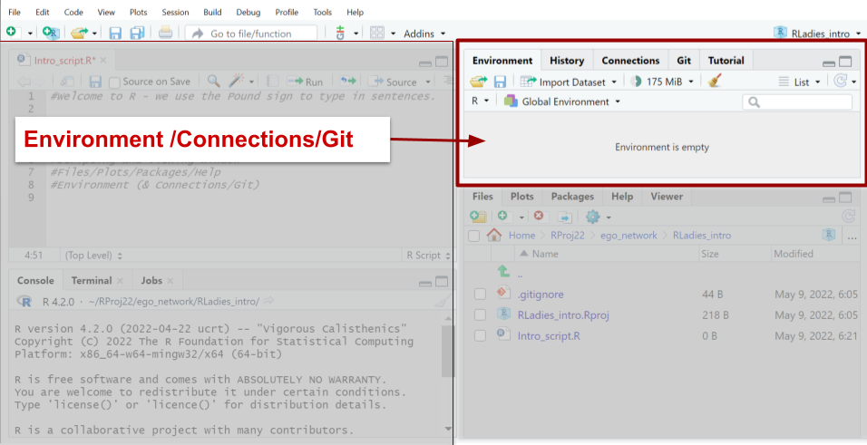
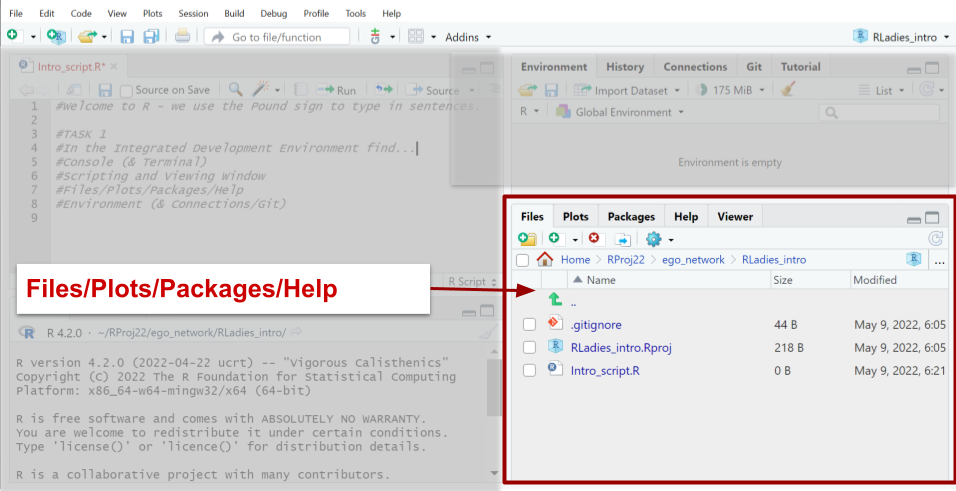

```{r setup, include=FALSE}
knitr::opts_chunk$set(echo = FALSE)
```


## R programing


##IDE Panes

IDE Panes

- Console (& Terminal)
- Scripting and Viewing Window
- Files/Plots/Packages/Help
- Environment (& Connections/Git)


## Console 
<div class="columns-2">
  {width=375px}


- <font size="2">Type into the console to be evaluated</font>


</div>


## Scripting 
<div class="columns-2">
  {width=375px}


- <font size="2">Save code for later use either in script or R Markdown.</font>


</div>


## Environment 
<div class="columns-2">
  {width=375px}


- <font size="2">We store data/info/functions…</font>
- <font size="2">Create a R object with the storage object <- or =</font>
- <font size="2">We will be using the <-</font>


</div>


## Files 
<div class="columns-2">
  {width=375px}


- <font size="2">Navigate through FILES</font>
- <font size="2">Create Plots</font>
- <font size="2">Packages - view current and install new</font>
- <font size="2">Documentation in r via (help or ?)</font>


</div>

## seperator1
<div class="centered">


<span style="color:red"><font size="10">TASK 1</font></span>

</div>

## TASK 1

<div class="centered">
  {width=600px} 
  

## seperator2
<div class="centered">


<span style="color:red"><font size="10">TASK 2</font></span>

</div>

##

```{r cars, echo = TRUE}
summary(cars)
```

## Slide with Plot

```{r pressure}
plot(pressure)
```

