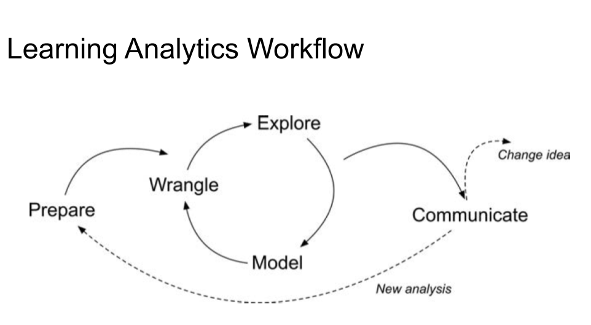
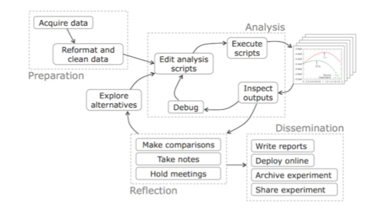

```{r setup, include=FALSE}
######DO NOT MODIFY. This will load required packages and data.

knitr::opts_chunk$set(echo = TRUE)

```


# 1. Set up 

We are going to go into `Global Options` and set up a few things for a smoother workflow. 
To get to Global options:

- In the menu bar click `Tools` then `Global Options.`
    + 1. `R General` -> (untick) Restore .RData into workspace at startup.
    + 2. `R General` -> Save workspace to .RData on exit: Never
    + 3. `R Markdown` -> Show output preview in: Viewer Pane

# 2. Introduction

Let's get familiar with the R Markdown layout and syntax.
    
## 2.1 YAML Heading

Yaml is not a markup language. It contains, title, author, dates, type of document etc. YAML is picky!

Check out this site on[Yaml heading](https://zsmith27.github.io/rmarkdown_crash-course/lesson-4-yaml-headers.html) by @Smith.

## 2.2 R Markdown

This is an R Markdown document. Markdown is a simple formatting syntax for authoring HTML, PDF, webpage and MS Word documents. For more details on using R Markdown see <http://rmarkdown.rstudio.com> or [The R Markdown: the definitive guide] (https://bookdown.org/yihui/rmarkdown/).

When you click the **Knit** button a document will be generated that includes both content as well as the output of any embedded R code chunks within the document. You can also press `ctrl`+`shift`+`k`

### 2.2a. Markdown Syntax

R Markdowns syntax is based off of [Pandoc's Markdown](https://pandoc.org/MANUAL.html). 

##### Headers

    + # One
    + ## Two
    + ### Three
    + #### Four
    + ##### Five

### 👉 Your Turn ⤵
- Add a # hash symbol in front of a short sentence and press `Knit` 

##### Bullet points
Bullet points can be used with a `single dash` or a `plus sign`

> Outcomes:

- Learn R Markdown.
    + Learn about Yaml heading.
    + Learn R Markdown Syntax.
- Learn how to read in data.
- Learn to wrangle data.


##### Task List

> Outcomes:

- [x] Get excited to learn R Markdown
- [ ] Meet new peeps
- [ ] Share my new knowledge

### 👉 Your Turn ⤵
Create a goal or two for today. You can use a *task list* or *bullets* click knit when complete.

##### Images and weblinks

Weblinks: [name of site or url](url link address)


Images:  
{width=80px}

# 3. Coding Introduction

## 3.1 Workflow
Each organization may have a familiar workflow. In Learning Analytics we use a five step process:
{width="60%"}

- 1.  Prepare
- 2.  Wrangle
- 3.  Explore
- 4.  Model
- 5.  Communicate

Philip Guo shares his [Data Science Workflow](https://cacm.acm.org/blogs/blog-cacm/169199-data-science-workflow-overview-and-challenges/fulltext) as: 

{width="60%"}


## 3.2 Code Chunks
Coding blocks are referred to as `coding chunks.` In R Markdown you can add a new code chunk two ways. 

By pressing `alt+shift+i`

or 

by adding triple backticks on either side of the code blob, but now add curly brackets at the end of the first triplet 

```{r}

```


This may not make sense know but you can suppress messages so that your knitted appearance is cleaner. We add them into the code chunk.
```{r warning=FALSE, message=FALSE}

```


### 👉 Your Turn ⤵
Go ahead and add a code chunk.


## 4. Let's get coding!

### 4.1 Prepare

- load in packages
- read in data to memory

First, we will Install Packages. We will be using the [Tidyverse packages](https://www.tidyverse.org/). It is a suite of **eight packages** that share the same philosophy. Each package is a collection of code, data and documentation like objects and functions that are useful for a specific purpose. 

Two things to add packages:

1.  Download packages to computer with `intall.packages("")`.
2.  Read in package to Rstudio with `library()`.

You only install the package once, ever...mostly ever :). But, you will need to read in the package to Rstudio for each session. Sometimes during the session.

We will also add a code chunk name. Names can only be used once in a session.

##### packages

```{r install_packages, message=FALSE}
#install package if it is your first time

# Call package
library(tidyverse)
```


##### read in data

Read in the file using the `readr` [package] (https://readr.tidyverse.org/reference/read_delim.html)

Modified from [Carpentry-R Programming](https://swcarpentry.github.io/r-novice-inflammation/)

We are studying inflammation in patients who have been given a new treatment for arthritis, and need to analyze the first dozen data sets of their daily inflammation. The data sets are stored in CSV format (comma-separated values): each **row holds information for a single patient**, and the **columns represent successive days**. The first few rows of our first file look like this:


### 4.2 Wrangle

- read in data and inspect

```{r read_df}
#read in data with the readr package
infla_dt <- read_csv("~/RProj22/RLadies_intro/data/inflammation-01.csv", col_names = FALSE)

```

Naming conventions:
- start variable names with lower case letters 
- separate words in variable names with underscores, and 
- use only lowercase letters, underscores, and numbers in variable names.


We can look at the class of the data
```{r}
class(infla_dt)
```

We can look at the dimensions of the data
```{r}
dim(infla_dt)
```

We want to change the variable names to day_1, day_2. We are going to do it the long way with `rename` function from [`dplyr` package](https://dplyr.tidyverse.org/reference/rename.html)
```{r}
#rename variables to days with new_name = old_name
infla_dt <- infla_dt %>%
  rename(day_1 = X1,
         day_2 = X2,
         day_3 = X3,
         day_4 = X4,
         day_5 = X5,
         day_6 = X6,
         day_7 = X7,
         day_8 = X8,
         day_9 = X9,
         day_10 = X10,
         day_11 = X11,
         day_12 = X12,
         day_13 = X13,
         day_14 = X14,
         day_15 = X15,
         day_16 = X16,
         day_17 = X17,
         day_18 = X18,
         day_19 = X19,
         day_20 = X20,
         day_21 = X21,
         day_22 = X22,
         day_23 = X23,
         day_24 = X24,
         day_25 = X25,
         day_26 = X26,
         day_27 = X27,
         day_28 = X28,
         day_29 = X29,
         day_30 = X30,
         day_31 = X31,
         day_32 = X32,
         day_33 = X33,
         day_34 = X34,
         day_35 = X35,
         day_36 = X36,
         day_37 = X37,
         day_38 = X38,
         day_39 = X39,
         day_40 = X40)
```

Add a column to uniquely identify the patients as one through 60.
```{r}

# add unique identifier
infla_dt$patient <- c(1:60)

```

Finally, let's relocate the patient variable to the first column.
```{r}
infla_dt<- infla_dt%>%
  relocate(patient)

```


We can check to see if our data is loaded with the following functions

`head()`
`tail()`
`view()`

### 👉 Your Turn ⤵
Go ahead and add a code chunk and inspect the data.


### 4.3 Explore

We can call individual values by their row and column through indexing.
```{r}
infla_dt[1,1]
```


### 👉 Your Turn ⤵
What if we want the twentieth row and thirtieth column

```{r}
#add your code here
```


If we want more than one we use the `c()` package.
```{r}
infla_dt[c(1, 3, 5), c(10, 20)]
```

We can select the first ten columns of values for the first four rows
```{r}
infla_dt[1:4, 1:10]

```

### 👉 Your Turn ⤵
How do we select the first ten columns of rows 5 to 10?

```{r}
#add your code here
```


##### subsetting data
Let's explore some basic math on patient 1
```{r}
# first row, all of the columns
patient_1 <- infla_dt[1, ]

# max inflammation for patient 1
max(patient_1)

#or we could have called in base R
# max inflammation for patient 2
max(infla_dt[1, ])
```

We can even look at summary statistics for day 7
```{r}
# minimum inflammation on day 7
min(infla_dt[, 7])
# mean inflammation on day 7
mean(infla_dt[, 7])
# median inflammation on day 7
median(infla_dt[, 7])
# standard deviation of inflammation on day 7
sd(infla_dt[, 7])
```


### 👉 Your Turn ⤵
Find summary statistics for day 30.
```{r}
# add you code here
```


Suppose you want to determine the maximum inflammation for patient 5 across days three to seven. To do this you would extract the relevant subset from the data frame and calculate the maximum value. What do you think the code will be?

```{r}
max(infla_dt[5, 3:7])
```

Calculate the average inflammation of each patient with `rowMeans` function and save as `avg_patient_inflammation`.
```{r}
avg_patient_inflammation <- rowMeans(infla_dt)
```

Calculate the average inflammation of each day with `colMeans` function and save as `avg_day_inflammation`.
```{r}
#add your code here
```


### 4.4 Model
- plot the result.

We can quickly plot the results with the `plot` function.

```{r}
plot(avg_patient_inflammation)
```


### 4.5 Communicate

Is the average patient inflammation what you would expect?

How could this information be used?


**References:**
Harrison, P., Barugahare, A., Tsyganov, K. (2020). *Reproducible Research.* https://monashdatafluency.github.io/r-rep-res/index.html

Smith, Z (2020). *R Markdown Crash Course.* https://zsmith27.github.io/rmarkdown_crash-course/index.html 

Xie, Y., Allaire, J. J., & Grolemund, G. (2018). *R markdown: The definitive guide.* Chapman and Hall/CRC. https://bookdown.org/yihui/rmarkdown/
